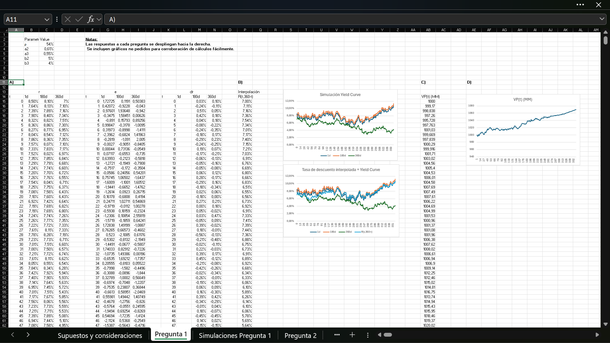
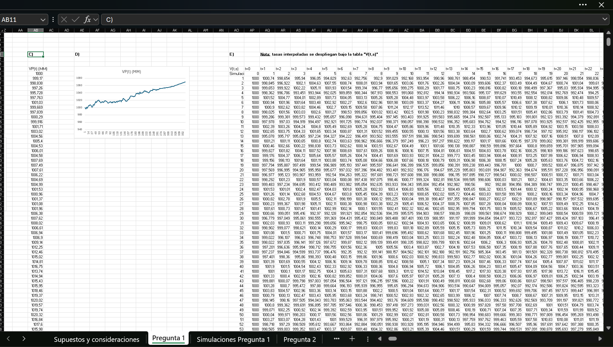
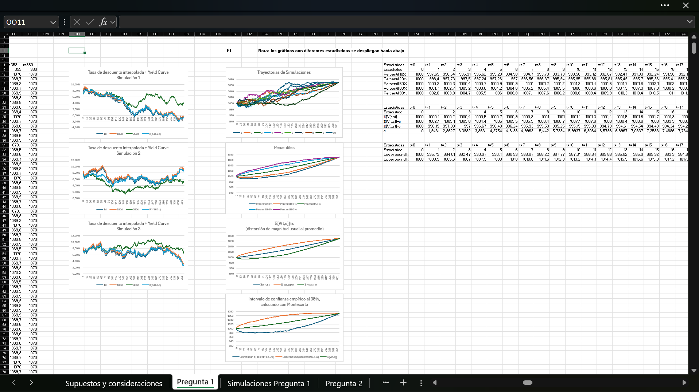
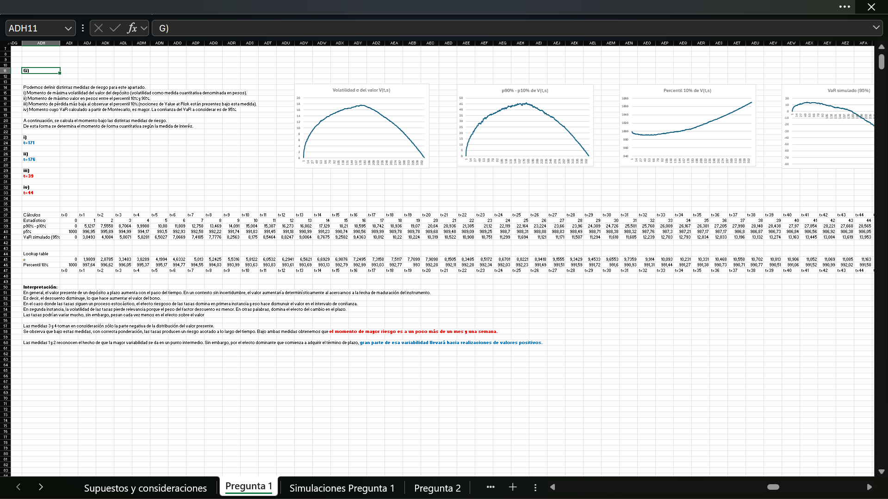

# Tarea 2

**Warning**: Due to large size of file `Tarea 2, Oscar Herrera.xlsx` because of stochastic processes Monte Carlo simulations, this may cause an application hang, system freeze or even difficulties to open the file on some devices.

**This assignment is the core homework of the course.**

Contents:
- Term Deposit Mark to Market.
- Yield Curve Monte Carlo simulations.
    - Vasicek/Ho-Lee models for interest rates.
    - Cox-Ingersoll-Ross model for interest rates.
    - Correlated Brownian motions for interest rates (Multi-factor Vasicek/Multi-factor Hull-White models).
- Interest Rates interpolation.
- Risk measures via Monte Carlo.
- Leveraged Fixed Income Portfolio valuation.
- Duration (interest rates sensibility).
- Value at Risk.
- Portfolio VaR Hedging with Forwards.

Note:
- For every interaction with Excel file, simulations might be generated randomly again.

## Excel File Navigation Order

1. Default landscape page `Pregunta 1`.

2. Scroll right the page ... and go to answers 1.C), 1.D) & 1.E).

3. Scroll right further to see columns `"OO:PH"` to see more answers.

4. Go to `"ADH11"` to see last `Pregunta 1` answers.

5. For Question 2, just scroll right trhough page `Pregunta 2`. This sheet is more easy to navigate.

